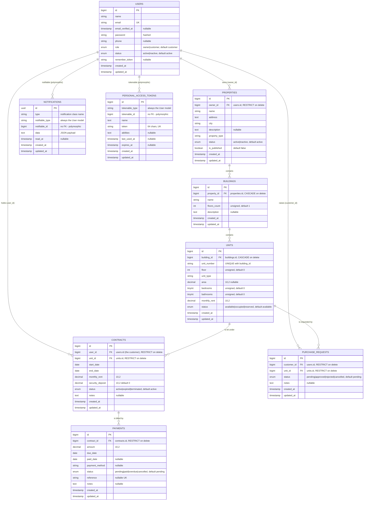

# PropSpace — Entity Relationship Diagram

Source of truth: `backend/database/migrations/` and `backend/app/Models/`.
Nothing in this document is inferred from an older design — every column,
key and cardinality below was read out of a migration or a model relationship.

- Editable source: [`propspace-erd.mmd`](./propspace-erd.mmd) (Mermaid; paste
  into <https://mermaid.live> to export an image)
- The same diagram is inlined below so it renders directly on GitHub.

Related documentation: [API reference](../API/README.md) · [UML diagrams](../UML/README.md)

---

## 1. Diagram



---

## 2. The ownership chain

Every record in PropSpace ultimately belongs to one owner, and it is reached
through the property:

```text
users (role = owner)
  └── properties (owner_id)
        └── buildings (property_id)
              └── units (building_id)
                    ├── contracts (unit_id) ──── payments (contract_id)
                    └── purchase_requests (unit_id)
```

The customer side attaches to the same records from the other direction:

```text
users (role = customer)
  ├── contracts (user_id)          the lease they hold
  └── purchase_requests (customer_id)   the units they enquired about
```

Both `Owner` and `Customer` are rows in the **same `users` table**,
distinguished only by `users.role`.

> **There is no `tenants` table.** The tenant on a lease is a `users` row with
> `role = 'customer'`, referenced by `contracts.user_id`. The column was
> originally `contracts.tenant_id` and was renamed by
> `2026_08_25_175049_rename_contracts_tenant_id_to_user_id.php`.

---

## 3. Relationships in detail

| # | Parent | Child | FK column | Cardinality | On delete | Nullable |
|---|--------|-------|-----------|-------------|-----------|----------|
| 1 | `users` (owner) | `properties` | `properties.owner_id` | 1 → 0..* | `RESTRICT` | No |
| 2 | `properties` | `buildings` | `buildings.property_id` | 1 → 0..* | `CASCADE` | No |
| 3 | `buildings` | `units` | `units.building_id` | 1 → 0..* | `CASCADE` | No |
| 4 | `units` | `contracts` | `contracts.unit_id` | 1 → 0..* | `RESTRICT` | No |
| 5 | `users` (customer) | `contracts` | `contracts.user_id` | 1 → 0..* | `RESTRICT` | No |
| 6 | `contracts` | `payments` | `payments.contract_id` | 1 → 0..* | `RESTRICT` | No |
| 7 | `units` | `purchase_requests` | `purchase_requests.unit_id` | 1 → 0..* | `RESTRICT` | No |
| 8 | `users` (customer) | `purchase_requests` | `purchase_requests.customer_id` | 1 → 0..* | `RESTRICT` | No |
| 9 | `users` | `notifications` | `notifiable_type` + `notifiable_id` | 1 → 0..* | none (no FK) | n/a |
| 10 | `users` | `personal_access_tokens` | `tokenable_type` + `tokenable_id` | 1 → 0..* | none (no FK) | n/a |

**Every foreign key in this schema is `NOT NULL`.** There are no optional
relationships: a building always has a property, a unit always has a building,
a contract always has both a unit and a customer, a payment always has a
contract.

### Derived (non-column) relationships declared on the models

| Model | Relationship | Type | Path |
|-------|--------------|------|------|
| `Property` | `units()` | `hasManyThrough` | properties → buildings → units |
| `Unit` | `property()` | `hasOneThrough` | units → buildings → properties |
| `Unit` | `payments()` | `hasManyThrough` | units → contracts → payments |
| `User` | `payments()` | `hasManyThrough` | users → contracts → payments |

Every model that hangs off a property also exposes `scopeOwnedBy()` and
`ownerId()`, which walk the chain in section 2. Those two methods are what the
policies and the owner-facing controllers use for ownership checks — see
[`docs/API/authorization.md`](../API/authorization.md).

---

## 4. Keys and constraints

### Primary keys

| Table | Primary key |
|-------|-------------|
| `users`, `properties`, `buildings`, `units`, `contracts`, `payments`, `purchase_requests` | auto-increment `bigint id` |
| `notifications` | `uuid id` (Laravel generates it) |
| `personal_access_tokens` | auto-increment `bigint id` |

### Unique constraints

| Table | Constraint | Why it exists |
|-------|-----------|---------------|
| `users` | `email` unique | one account per address; also validated in `RegisterRequest` |
| `units` | `unique(building_id, unit_number)` | a unit number is unique within its building, not globally. `UnitController::guardUniqueUnitNumber()` turns a violation into a 422 instead of a database error |
| `payments` | `reference` unique (nullable) | a payment reference, when supplied, identifies one payment |
| `personal_access_tokens` | `token` unique | Sanctum |

> `users.phone` is **not** unique at the database level, but
> `RegisterRequest` and `UpdateProfileRequest` both apply
> `Rule::unique('users','phone')`, so it behaves as unique through the API.

### Indexes beyond the keys

| Table | Index | Purpose |
|-------|-------|---------|
| `notifications` | `(notifiable_type, notifiable_id, read_at)` | the bell's "my unread, newest first" query on every poll |
| `personal_access_tokens` | `expires_at`, `morphs(tokenable)` | Sanctum lookups |

### Enumerations

| Table.column | Allowed values | Default |
|--------------|----------------|---------|
| `users.role` | `owner`, `customer` | `customer` |
| `users.status` | `active`, `inactive` | `active` |
| `properties.status` | `active`, `inactive` | `active` |
| `units.status` | `available`, `occupied`, `reserved` | `available` |
| `contracts.status` | `active`, `expired`, `terminated` | `active` |
| `payments.status` | `pending`, `paid`, `overdue`, `cancelled` | `pending` |
| `purchase_requests.status` | `pending`, `approved`, `rejected`, `cancelled` | `pending` |

There is **no `sold` unit status**, and **no `admin`, `property_manager` or
`tenant` role** — `2026_08_25_165643_fix_users_role_enum.php` narrowed the
enum to exactly `owner` and `customer`.

---

## 5. Notifications

Notifications use **Laravel's own `notifications` table**, created by
`2026_08_28_090000_create_notifications_table.php`. No bespoke notification
table was added, and **no foreign key to `users` exists** — the table is
polymorphic:

| Column | Meaning |
|--------|---------|
| `id` | UUID primary key |
| `type` | the notification class, e.g. `App\Notifications\ContractNotification` |
| `notifiable_type` | always `App\Models\User` in this application |
| `notifiable_id` | the user's id |
| `data` | JSON payload: `type`, `title`, `message`, `url` |
| `read_at` | `NULL` while unread; a timestamp once read |

Because the relationship is polymorphic, owners and customers share one table
with no role column: a notification belongs to a *user*, not to a portal. The
`User` model uses the `Notifiable` trait, which is what supplies
`notifications()`, `unreadNotifications()` and `markAsRead()`.

The `data` payload shape is fixed by `App\Notifications\ActivityNotification`
and is the same for all four notification classes
(`ContractNotification`, `PaymentNotification`, `PurchaseRequestNotification`).

---

## 6. Tables intentionally left out of the diagram

These exist in the schema but carry no application data, so including them
would only obscure the model:

| Table | Migration | Note |
|-------|-----------|------|
| `cache`, `cache_locks` | `0001_01_01_000001` | `CACHE_STORE=database` |
| `jobs`, `job_batches`, `failed_jobs` | `0001_01_01_000002` | `QUEUE_CONNECTION=database`; no worker runs in development, which is why notifications are **not** queued |

`personal_access_tokens` **is** shown, because Sanctum tokens are the
application's authentication mechanism and the token↔user link is part of
understanding how a request is identified.

There is no `sessions` and no `password_reset_tokens` table: the users
migration never creates them (its `down()` drops them defensively), the API is
stateless, and `SESSION_DRIVER=file`.

---

## 7. Regenerating / verifying

```bash
cd backend
php artisan migrate:fresh --seed   # rebuild the schema from the migrations
php artisan test                   # 156 tests, includes DemoSeedTest schema assertions
```

`tests/Feature/DemoSeedTest.php` asserts the invariants this diagram
describes — no orphans, contracts and requests only ever belong to customers,
every occupied unit has exactly one active contract, and no unsupported enum
value is ever written.
