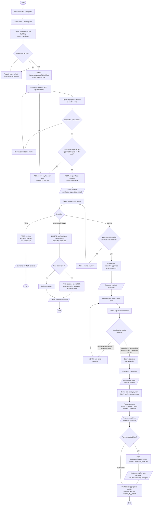

# Activity Diagram — from listing to collected rent

**Derived from:** `Customer\PurchaseRequestController`,
`Owner\PurchaseRequestController`, `Owner\ContractController`,
`Owner\PaymentController`, `Owner\PropertyController` (publish/unpublish),
`Unit::scopePubliclyVisible()`.

This is the one business flow that crosses both roles and touches every
entity: **Property → Building → Unit → Purchase request → Contract → Payment.**

## Decision points, and where each is enforced

| Decision | Enforced in | Failure response |
|----------|-------------|------------------|
| Is the property visible to the public? | `Customer\PropertyController::publicQuery()` — `is_published && status='active'` | `404` (indistinguishable from not existing) |
| Is the unit requestable? | `Customer\PurchaseRequestController@store` — `unit.status === 'available'` | `422 "That unit is not currently available."` |
| Duplicate open request? | same method — any `pending`/`approved` request by this customer on this unit | `422 "You already have an open request for this unit."` |
| Can the request be approved? | `Owner\PurchaseRequestController@approve` — status `pending` **and** unit `available` | `422` with the reason |
| Can a contract be written on this unit? | `ContractController::unitIsLettableTo()` | `422 "This unit is not available."` |
| Is the unit the owner's? | `ContractController@store/@update` | `403 "You are not authorized to use this unit."` |
| Can a payment be raised on this contract? | `PaymentController@store` → `Gate::authorize('update', $contract)` | `403` |

## Two shortcuts the flow allows

- A contract can be created **directly on an `available` unit**; the purchase
  request path is not mandatory.
- A purchase request can be **cancelled by the customer at any point while it
  is `pending` or `approved`**, which releases a reservation it created.

Both are in the code, so both are in the diagram.
