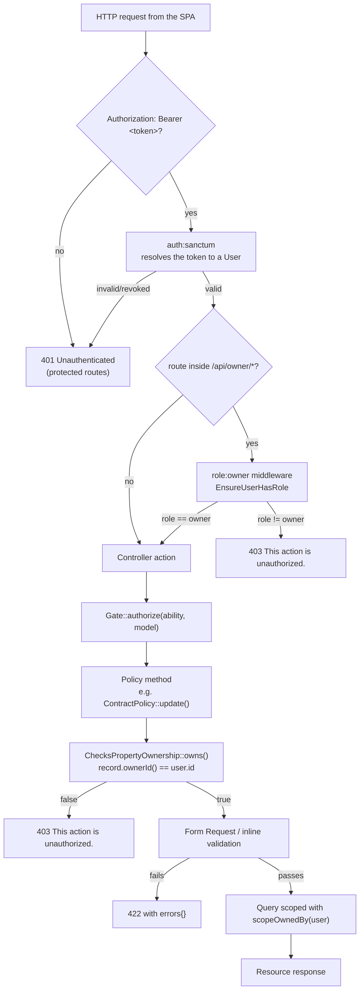
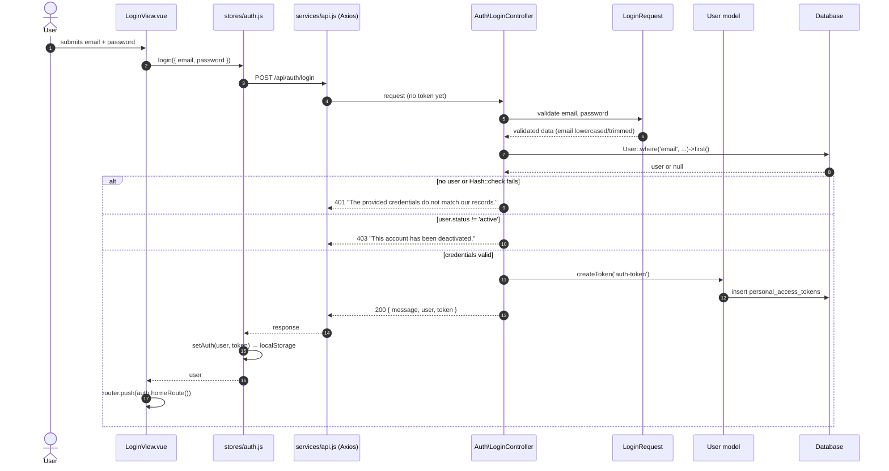

# Authentication & Authorization

**Derived from:** `backend/bootstrap/app.php`, `backend/routes/api.php`,
`backend/app/Http/Controllers/Auth/*`, `backend/app/Http/Middleware/EnsureUserHasRole.php`,
`backend/app/Policies/*`, `backend/config/sanctum.php`,
`frontend/src/services/api.js`, `frontend/src/stores/auth.js`,
`frontend/src/router/index.js`.

## The actual chain



Written as the layers the request passes through:

```text
Client (Axios, bearer token)
    ↓
auth:sanctum                    → 401 if no/expired/revoked token
    ↓
role:owner middleware           → 403 if the role is wrong (owner routes only)
    ↓
Policy via Gate::authorize()    → 403 if the record is not theirs
    ↓
Ownership verification          → record.ownerId() walked through the property chain
    ↓
Validation (FormRequest)        → 422 on bad input
    ↓
Query scoping (scopeOwnedBy)    → lists can only ever contain own records
    ↓
Controller → API Resource → JSON
```

Two independent mechanisms protect owner data, and both are always on:

1. **Policies** decide whether one named record may be touched.
2. **Query scoping** (`scopeOwnedBy`) decides what a *list* may contain, so an
   index endpoint cannot leak another owner's rows even though no single
   record was named.

Customer-facing endpoints are scoped structurally instead: they start from
`$request->user()->contracts()` / `->payments()` / `->notifications()`, so
there is no code path that could reach another user's rows.

## Login sequence (class level)



`homeRoute()` sends an owner to `/owner/dashboard` and a customer to `/`.

## Where each guard lives

| Layer | Class / file | Effect |
|-------|--------------|--------|
| Token issue | `Auth\LoginController`, `Auth\RegisterController` | `createToken('auth-token')` → plain-text Sanctum token returned once |
| Token transport | `frontend/src/services/api.js` | request interceptor sets `Authorization: Bearer <token>` from `localStorage` |
| Token check | `auth:sanctum` middleware (`routes/api.php`) | resolves `personal_access_tokens` → `User` |
| Role gate | `App\Http\Middleware\EnsureUserHasRole`, aliased `role` in `bootstrap/app.php` | `role:owner` on the `/api/owner` group |
| Record authorization | `App\Policies\*` via `Gate::authorize()` in each controller | 403 on someone else's record |
| Ownership predicate | `App\Policies\Concerns\ChecksPropertyOwnership::owns()` | owner **and** `ownerId()` match |
| Ownership chain | `scopeOwnedBy()` / `ownerId()` on each model | walks unit → building → property → owner_id |
| Token revocation | `Auth\LogoutController` | deletes **only** the current access token |
| JSON errors | `bootstrap/app.php` → `shouldRenderJsonWhen(api/*)` | every API failure is JSON, never an HTML error page |

## Frontend guards are convenience, not security

`frontend/src/router/index.js` has `requiresAuth`, `requiresOwner` and
`requiresCustomer` meta flags, and `services/api.js` clears the session and
redirects to `/login` on any unexpected `401`. Both exist so the SPA does not
render a page that would only 403 — **the API enforces the same rules
independently**, and `tests/Feature/OwnerIsolationTest.php`,
`CustomerIsolationTest.php` and `frontend/e2e/isolation.spec.js` assert that
hiding a button is never what protects a record.

## Registration and role escalation

`RegisterRequest::allowedRoles()` returns `['customer']` unless
`ALLOW_OWNER_REGISTRATION=true` is set in `.env`, and the persisted role comes
from `resolvedRole()` — never straight from the request body. `UpdateProfileRequest`
does not validate `role` or `status` at all, and `ProfileController::update()`
persists only `name`, `email`, `phone` and (with the current password)
`password`, so a customer cannot promote themselves to owner.
