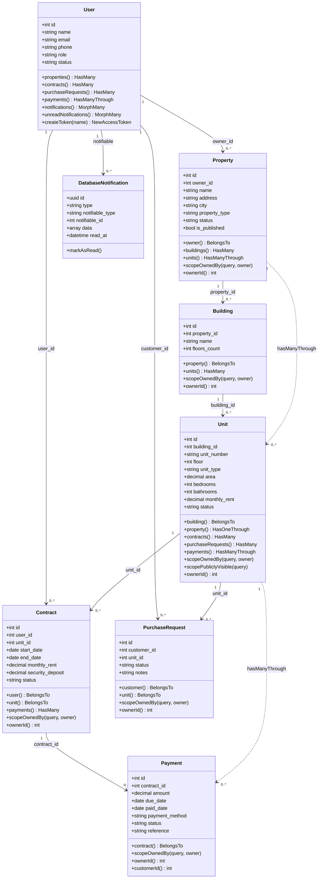
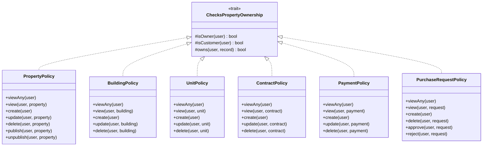
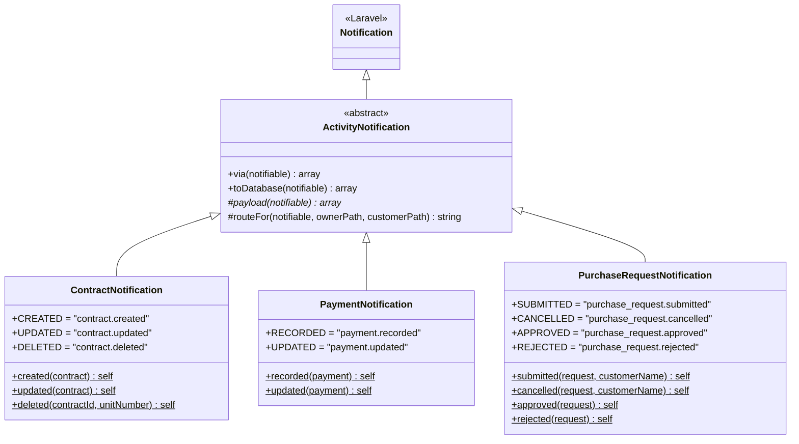
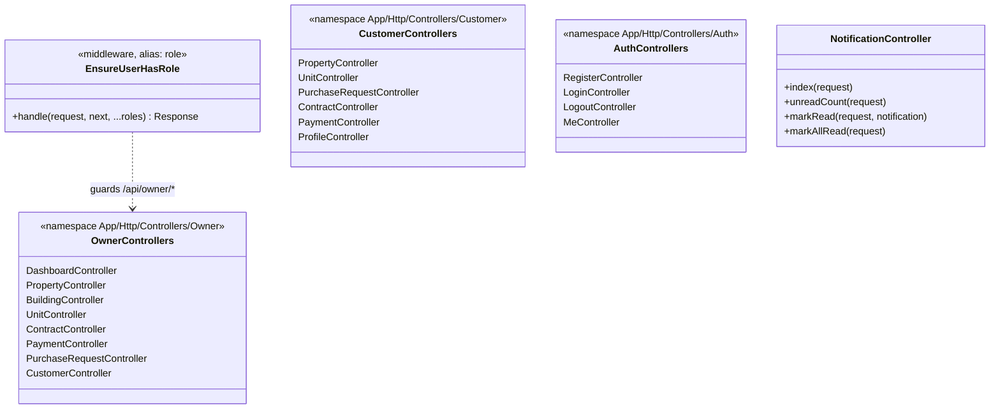

# Class Diagram — backend domain model

**Derived from:** `backend/app/Models/*.php`, `backend/app/Policies/*.php`,
`backend/app/Notifications/*.php`, `backend/app/Http/Middleware/EnsureUserHasRole.php`.

Only the methods that carry domain meaning are shown. Eloquent's inherited API
(`save`, `find`, `where`, …) is omitted deliberately.

## Domain models

### Cardinality, read from the migrations

| Association | Cardinality | Note |
|-------------|-------------|------|
| `User (owner) → Property` | `1 .. 0..*` | `properties.owner_id` NOT NULL |
| `Property → Building` | `1 .. 0..*` | cascade delete |
| `Building → Unit` | `1 .. 0..*` | cascade delete |
| `Unit → Contract` | `1 .. 0..*` | a unit accumulates leases over time; at most one is `active` |
| `User (customer) → Contract` | `1 .. 0..*` | `contracts.user_id` NOT NULL |
| `Contract → Payment` | `1 .. 0..*` | restrict on delete |
| `Unit → PurchaseRequest` | `1 .. 0..*` | restrict on delete |
| `User (customer) → PurchaseRequest` | `1 .. 0..*` | restrict on delete |
| `User → DatabaseNotification` | `1 .. 0..*` | polymorphic, no FK |

There is **no `Tenant` class**. The tenant on a lease is a `User` with
`role = 'customer'`, reached via `Contract::user()`.

## Policies

`owns()` is the single ownership predicate: it returns true only when the user
is an owner **and** `record->ownerId()` equals their id. Being an owner is
never sufficient on its own.

Policies are resolved by Laravel's conventional `App\Policies\{Model}Policy`
auto-discovery — there is no policy registration in `AppServiceProvider`.

## Notifications

`via()` returns `['database']` for every notification — there is no mail
channel and no broadcasting configured. They are deliberately **not queued**:
the app runs the `database` queue driver with no worker in development, so a
queued notification would never arrive.

Every payload has the same four keys, which is what lets one Vue component
render any notification: `type`, `title`, `message`, `url`.

## HTTP layer

API Resources shape every response:
`UserResource`, `PropertyResource`, `BuildingResource`, `UnitResource`,
`ContractResource`, `PaymentResource`, `PurchaseRequestResource`,
`NotificationResource`.
