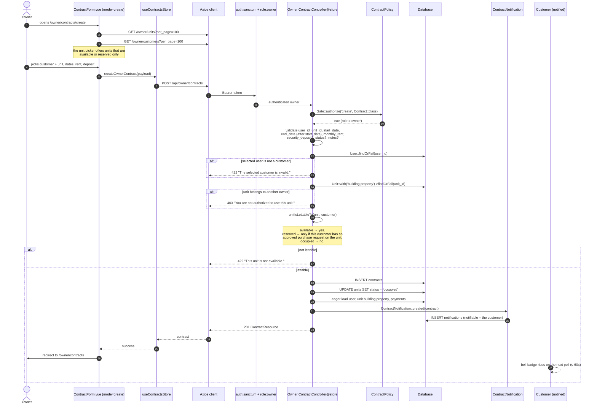

# Sequence — Owner creates a contract

**Derived from:** `backend/app/Http/Controllers/Owner/ContractController@store`,
`backend/app/Policies/ContractPolicy`, `backend/app/Notifications/ContractNotification`,
`frontend/src/views/owner/Contracts/ContractForm.vue`,
`frontend/src/views/owner/Contracts/Create.vue`,
`frontend/src/stores/contracts.js`, `frontend/src/services/contracts.js`.

## Notes on what the code actually does

- **No database transaction wraps `store()`.** The insert and the unit status
  update are two statements; the transaction in this controller exists only on
  `update()` and `destroy()`. Documented as implemented, not as idealised.
- The customer, not the owner, is notified — the customer cannot see the owner
  create the lease any other way
  (`NotificationTest::test_creating_a_contract_notifies_the_customer_not_the_owner`).
- `status` defaults to `active` at the database level when it is not sent.
- Validation is inline in the controller; there is no `StoreContractRequest`
  form-request class for contracts.
