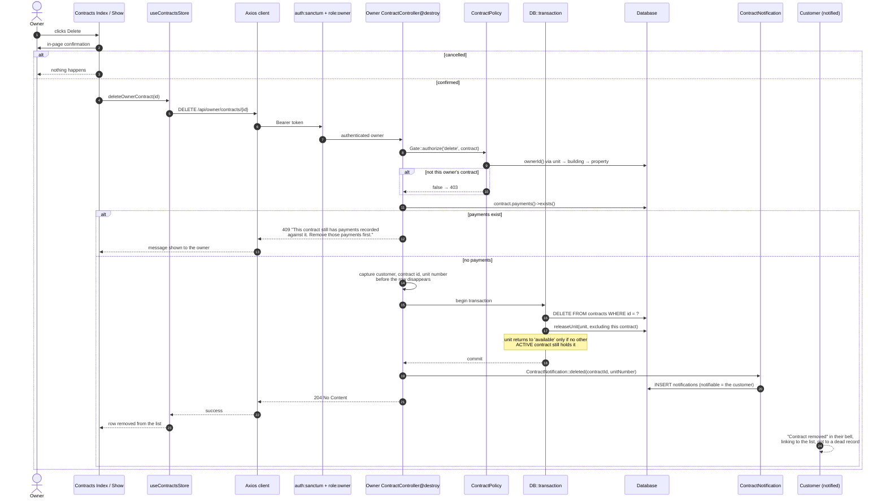

# Sequence — Owner deletes a contract

**Derived from:** `backend/app/Http/Controllers/Owner/ContractController@destroy`,
`backend/app/Policies/ContractPolicy::delete()`,
`backend/app/Notifications/ContractNotification::deleted()`,
`frontend/src/views/owner/Contracts/Index.vue`,
`frontend/src/views/owner/Contracts/Show.vue`,
`frontend/src/stores/contracts.js`.

## Why 409 rather than a cascade

`payments.contract_id` is `RESTRICT` on delete: collection history has to
outlive the contract. Deleting through the database would fail with a foreign
key error, so the controller checks first and answers `409 Conflict` with a
message the UI can show directly. The same pattern is used by
`PropertyController@destroy`, `BuildingController@destroy` and
`UnitController@destroy`.

**A customer is never able to reach this endpoint** — `role:owner` stops them
at the middleware, and `ContractPolicy::delete()` would refuse anyway
(`owner-contracts.spec.js`: "a customer cannot edit or delete a contract
through the owner API").

## Deletion effects

| Effect | Happens? |
|--------|----------|
| Contract row deleted | yes (hard delete — no soft deletes anywhere in this project) |
| Unit released to `available` | only when no other `active` contract references it |
| Payments deleted | never — their existence blocks the delete with 409 |
| Purchase requests touched | no |
| Customer notified | yes, after the transaction commits |
