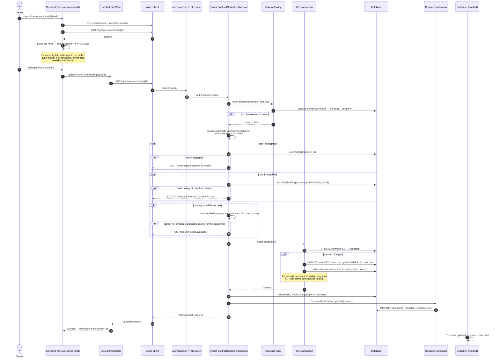

# Sequence — Owner edits a contract

**Derived from:** `backend/app/Http/Controllers/Owner/ContractController@update`,
`backend/app/Policies/ContractPolicy::update()`,
`backend/app/Notifications/ContractNotification::updated()`,
`frontend/src/views/owner/Contracts/Edit.vue`,
`frontend/src/views/owner/Contracts/ContractForm.vue` (`mode="edit"`),
`frontend/src/stores/contracts.js`.

## Behaviour this diagram is asserting

| Step | Implementation detail |
|------|----------------------|
| Partial update | every rule is `sometimes`; only the keys sent are written |
| Staying on the same unit | always allowed — no availability check is run |
| Moving to a new unit | must clear the same bar as creating a contract, otherwise an edit would be a way to let an already-taken unit |
| Reserved target unit | allowed only when the contract's customer holds an **approved** purchase request on it |
| Old unit release | `releaseUnit()` frees it only if no other `active` contract references it — a unit accumulates contracts over time |
| Transaction | `DB::transaction` wraps the contract update **and** both unit status writes |
| Notification | sent after the transaction commits, to the customer on the contract |
| `PATCH` | the route accepts `PUT` and `PATCH`; the SPA uses `PUT` |

Covered by `tests/Feature/OwnerContractTest.php` and
`frontend/e2e/owner-contracts.spec.js`
("an edit is saved and shows up in the list", "the edit form surfaces API
validation errors").
