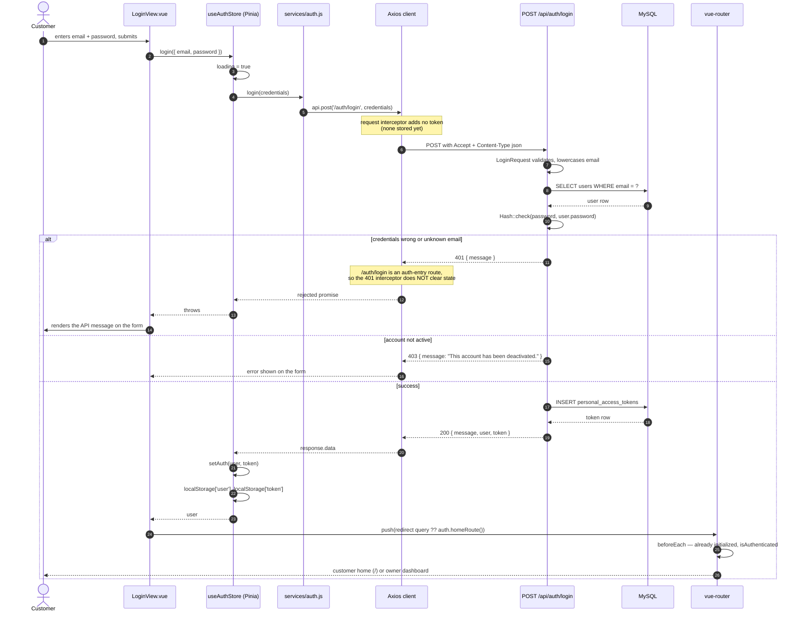
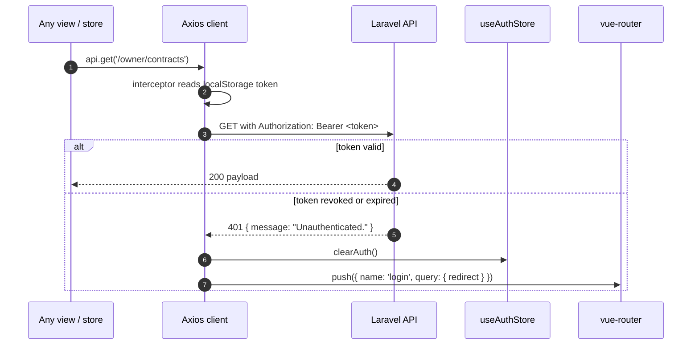
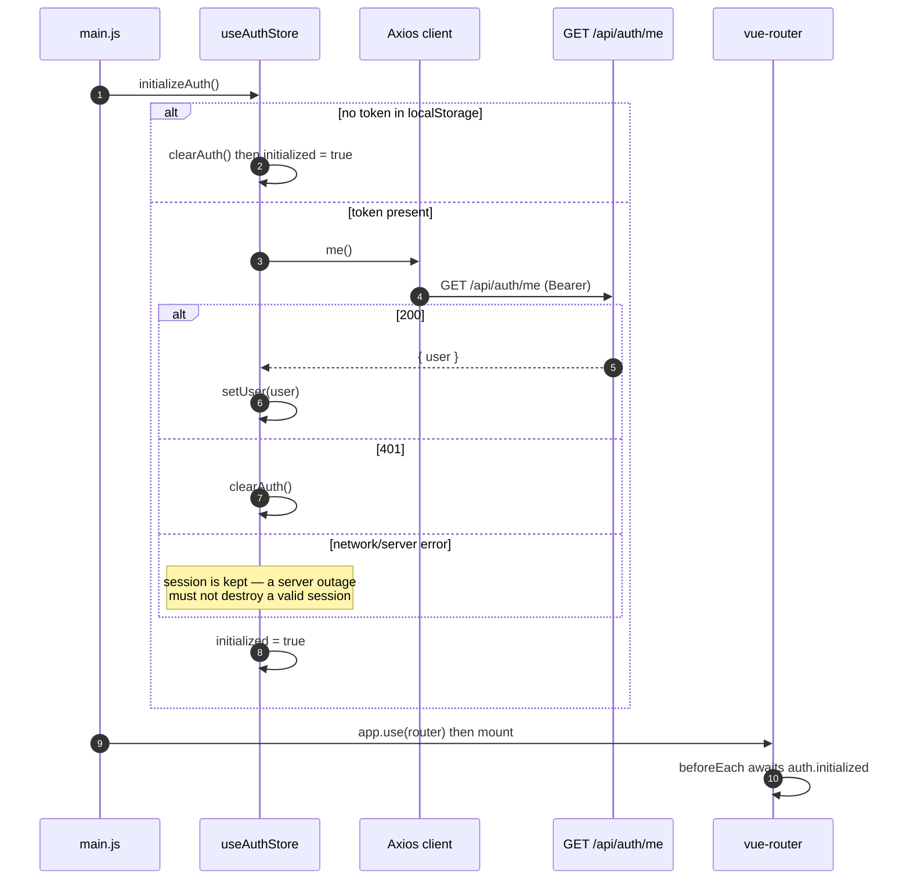

# Sequence — Customer login

**Derived from:** `frontend/src/views/auth/LoginView.vue`,
`frontend/src/stores/auth.js`, `frontend/src/services/auth.js`,
`frontend/src/services/api.js`, `frontend/src/router/index.js`,
`frontend/src/main.js`, `backend/app/Http/Controllers/Auth/LoginController.php`,
`backend/app/Http/Requests/Auth/LoginRequest.php`.

The flow is identical for an owner; only the destination route differs
(`homeRoute()` → `/owner/dashboard` for an owner, `/` for a customer).

## After login — every subsequent request

## Session restore on page refresh

The token is the only identity: `MeController` reads `$request->user()` and
never accepts a user id from the caller
(`AuthenticationTest::test_me_ignores_any_user_id_supplied_by_the_caller`).
