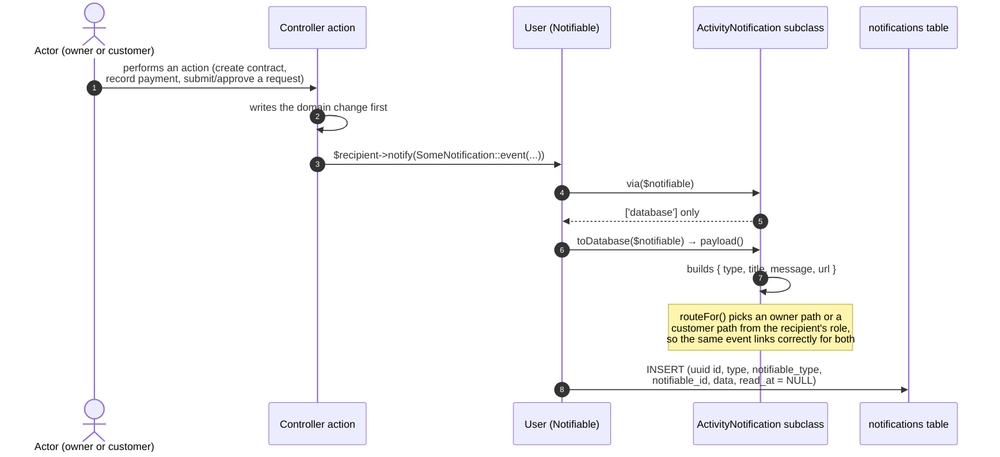
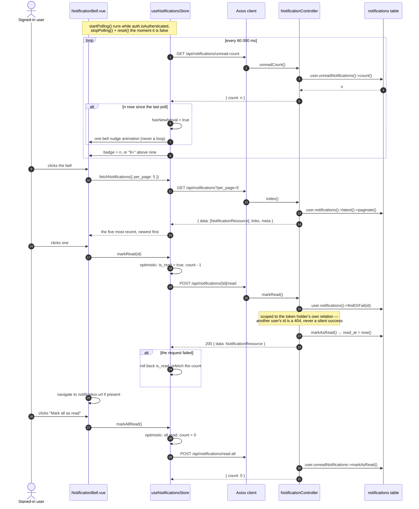
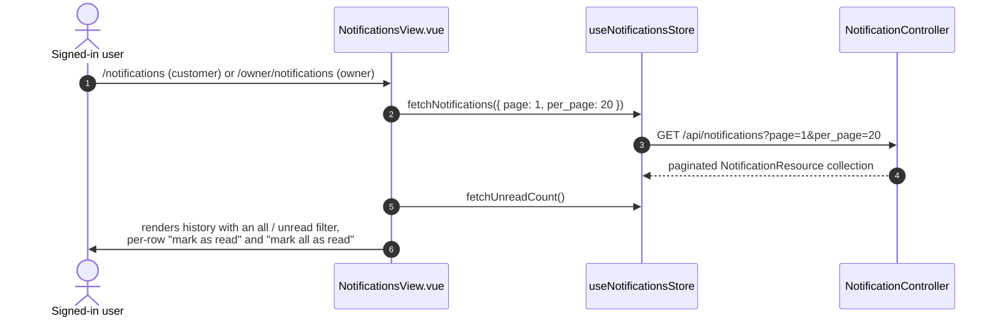

# Sequence — Notifications

**Derived from:** `backend/app/Notifications/ActivityNotification.php` and its
three subclasses, `backend/app/Http/Controllers/NotificationController.php`,
`backend/app/Http/Resources/NotificationResource.php`,
`backend/database/migrations/2026_08_28_090000_create_notifications_table.php`,
`frontend/src/stores/notifications.js`,
`frontend/src/services/notifications.js`,
`frontend/src/components/notifications/NotificationBell.vue`,
`frontend/src/views/NotificationsView.vue`.

## 1. Raising and storing a notification

Notifications are written **synchronously** — `ActivityNotification` does not
implement `ShouldQueue`, because the project runs the `database` queue driver
with no worker in development, so a queued notification would never arrive.

### Who gets notified, and when

| Event | Raised in | Recipient |
|-------|-----------|-----------|
| `contract.created` | `Owner\ContractController@store` | the customer on the lease |
| `contract.updated` | `Owner\ContractController@update` | the customer on the lease |
| `contract.deleted` | `Owner\ContractController@destroy` | the customer who held the lease |
| `payment.recorded` | `Owner\PaymentController@store` | the customer on the contract |
| `payment.updated` | `Owner\PaymentController@update` | the customer — **only on a real status change** |
| `purchase_request.submitted` | `Customer\PurchaseRequestController@store` | the **owner** of the unit |
| `purchase_request.cancelled` | `Customer\PurchaseRequestController@destroy` | the **owner** of the unit |
| `purchase_request.approved` | `Owner\PurchaseRequestController@approve` | the customer who raised it |
| `purchase_request.rejected` | `Owner\PurchaseRequestController@reject` | the customer who raised it |

Notifications flow **both ways**: owner actions notify customers, and customer
actions notify the owner of the unit. An actor is never notified of their own
action.

## 2. Polling, reading and marking read

## 3. Full history page

One Vue view serves both portals — the owner route renders it inside
`OwnerLayout`, the customer route inside `CustomerLayout`, and the data is
identical because a notification belongs to a user, not to a portal.

## Mechanism summary

| Question | Answer, from the code |
|----------|----------------------|
| Realtime? | **No.** No WebSockets, no broadcasting, no Echo. `BROADCAST_CONNECTION=log`. |
| How does the UI stay current? | Polling `GET /api/notifications/unread-count` every 60 seconds while signed in. |
| Is the list polled too? | No — only the count. The list is fetched when the dropdown opens or the history page loads. |
| Where are they stored? | Laravel's `notifications` table, polymorphic on `notifiable`. |
| Read state | `read_at` — `NULL` while unread. `NotificationResource` exposes it as `is_read` + `read_at`. |
| Scoping | structural: every query starts from `$request->user()->notifications()`. |
| Guests | no bell is rendered at all (`notifications.spec.js`: "a guest sees no bell at all"). |
