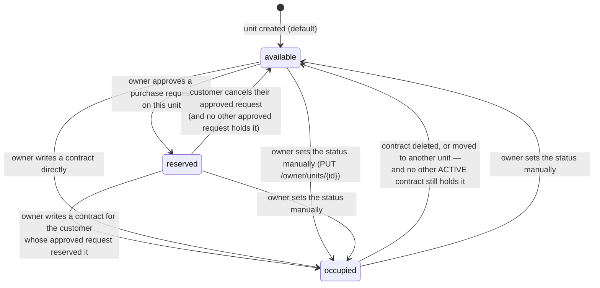
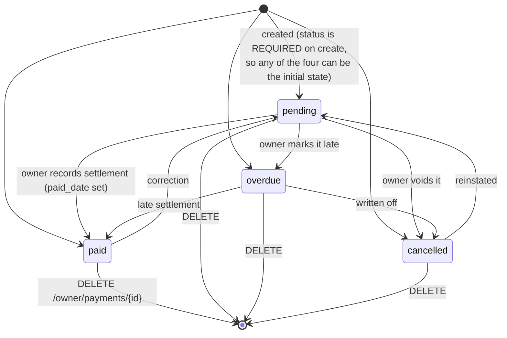
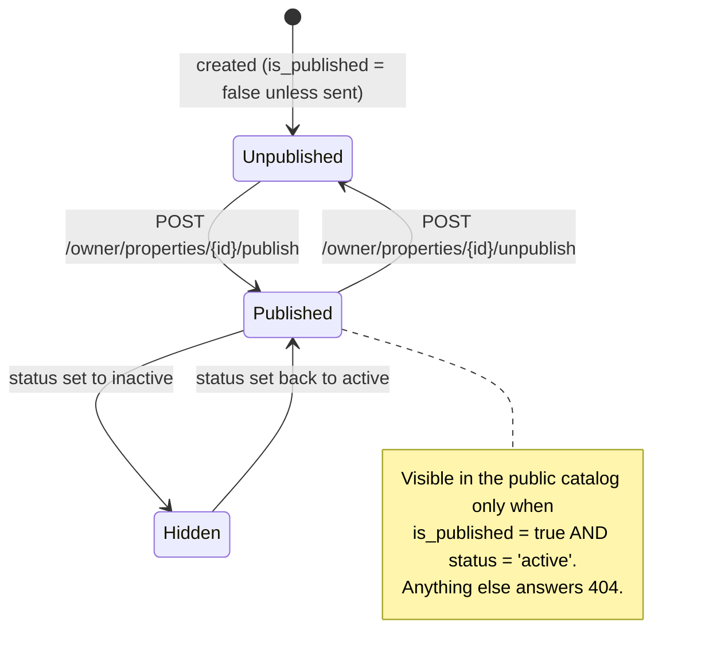

# State Diagrams

**Derived from:** the enum definitions in the migrations, and every write that
changes a status: `Owner\ContractController` (`releaseUnit`, `unitIsLettableTo`),
`Owner\PurchaseRequestController` (`approve`, `reject`),
`Customer\PurchaseRequestController` (`store`, `destroy`),
`Owner\PaymentController`, `Owner\PropertyController` (`publish`, `unpublish`).

Only statuses that exist in the schema are represented. There is no `sold`
unit status and no maintenance state anywhere in this system.

## Unit

`units.status` — `available` | `occupied` | `reserved`, default `available`.

The manual transitions exist because `UpdateUnitRequest` accepts
`status in [available, occupied, reserved]`; the automatic ones are the ones
the contract and purchase-request flows perform.

`releaseUnit()` never frees a unit that another **active** contract still
references — a unit accumulates contracts over time, so "this contract is
gone" is not on its own a reason to advertise the unit.

## Contract

`contracts.status` — `active` | `expired` | `terminated`, default `active`.

```mermaid
stateDiagram-v2
    [*] --> active : created (default; status is optional on create)
    active --> expired : owner sets status on PUT /owner/contracts/{id}
    active --> terminated : owner sets status on PUT /owner/contracts/{id}
    expired --> active : owner sets status back
    terminated --> active : owner sets status back
    active --> [*] : DELETE, only when no payments exist (else 409)
    expired --> [*] : DELETE, only when no payments exist
    terminated --> [*] : DELETE, only when no payments exist
```

There is **no automatic expiry job**: nothing in the codebase transitions a
contract to `expired` when `end_date` passes. `routes/console.php` schedules
nothing. Status is whatever the owner sets.

Only `active` contracts hold a unit occupied — `releaseUnit()` counts
`status = 'active'` only.

## Payment

`payments.status` — `pending` | `paid` | `overdue` | `cancelled`, default `pending`.

Every transition is an owner edit — there is **no scheduled job that marks
payments overdue**. A status change (and only a status change) notifies the
customer; editing the notes does not.

Payments are the only records that can be deleted freely; they are what blocks
deleting a contract.

## Purchase request

`purchase_requests.status` — `pending` | `approved` | `rejected` | `cancelled`,
default `pending`.

```mermaid
stateDiagram-v2
    [*] --> pending : customer submits (POST /api/purchase-requests)
    pending --> approved : owner approves — only if the unit is still available;<br/>the unit becomes reserved
    pending --> rejected : owner rejects — the unit is untouched
    pending --> cancelled : customer withdraws
    approved --> cancelled : customer withdraws; the reservation is released<br/>if no other approved request holds the unit
    approved --> [*] : consumed by a contract<br/>(the row stays approved; the unit becomes occupied)
    rejected --> [*]
    cancelled --> [*]
```

`approved` and `rejected` are terminal for the owner: approving or rejecting a
request that is not `pending` returns `422 "This request has already been
{status} and cannot be approved."`. Rows are never deleted — `destroy()` is a
transition to `cancelled`.

## Property publication

`properties.status` (`active`/`inactive`) and `properties.is_published`
(boolean) together decide public visibility.

