# Use Case Diagram

**Derived from:** `backend/routes/api.php`, `frontend/src/router/index.js`,
all controllers under `backend/app/Http/Controllers/`, and
`backend/app/Policies/`.

## Actors

| Actor | Who they are | How the system knows |
|-------|--------------|----------------------|
| **Visitor** | anyone with the URL, not signed in | no Sanctum token; only the public routes outside the `auth:sanctum` group |
| **Customer** | `users.role = 'customer'` | Sanctum token; blocked from `/api/owner/*` by the `role:owner` middleware |
| **Owner** | `users.role = 'owner'` | Sanctum token; reaches `/api/owner/*`, but only their own records |

There is no Admin actor. `users.role` accepts exactly `owner` and `customer`
(`2026_08_25_165643_fix_users_role_enum.php`).

```mermaid
flowchart LR
    Visitor(("Visitor<br/>not signed in"))
    Customer(("Customer"))
    Owner(("Owner"))

    subgraph Public["Public catalog — no authentication"]
        UC1["Browse published properties"]
        UC2["View property details"]
        UC3["View units in a property"]
        UC4["View unit details"]
        UC5["Register an account"]
        UC6["Log in"]
    end

    subgraph CustomerUC["Customer account"]
        UC7["Submit a purchase request"]
        UC8["Track own purchase requests"]
        UC9["Cancel own purchase request"]
        UC10["View own contracts"]
        UC11["View own payments"]
        UC12["View and update own profile"]
        UC13["Change own password"]
        UC14["View notifications"]
        UC15["Mark notification(s) as read"]
        UC16["Log out"]
    end

    subgraph OwnerUC["Owner portal"]
        UC20["View dashboard"]
        UC21["Manage properties (CRUD)"]
        UC22["Publish / unpublish a property"]
        UC23["Manage buildings (CRUD)"]
        UC24["Manage units (CRUD)"]
        UC25["View related customers"]
        UC26["Review purchase requests"]
        UC27["Approve / reject a request"]
        UC28["Manage contracts (CRUD)"]
        UC29["Manage payments (CRUD)"]
        UC30["View and update own profile"]
        UC31["View notifications"]
        UC32["Mark notification(s) as read"]
        UC33["Log out"]
    end

    Visitor --> UC1 & UC2 & UC3 & UC4 & UC5 & UC6

    Customer --> UC1 & UC2 & UC3 & UC4
    Customer --> UC7 & UC8 & UC9 & UC10 & UC11 & UC12 & UC13 & UC14 & UC15 & UC16

    Owner --> UC6
    Owner --> UC20 & UC21 & UC22 & UC23 & UC24 & UC25 & UC26 & UC27 & UC28 & UC29 & UC30 & UC31 & UC32 & UC33
```

## Use case → implementation

### Visitor / public

| Use case | Endpoint | Controller |
|----------|----------|------------|
| Browse published properties | `GET /api/properties` | `Customer\PropertyController@index` |
| View property details | `GET /api/properties/{property}` | `Customer\PropertyController@show` |
| View units in a property | `GET /api/properties/{property}/units` | `Customer\UnitController@index` |
| View unit details | `GET /api/units/{unit}` | `Customer\UnitController@show` |
| Register | `POST /api/auth/register` | `Auth\RegisterController` |
| Log in | `POST /api/auth/login` | `Auth\LoginController` |

Only properties with `is_published = true` **and** `status = 'active'` are
visible; anything else answers `404`, so an unpublished property is
indistinguishable from one that does not exist.

### Customer

| Use case | Endpoint | Controller |
|----------|----------|------------|
| Submit a purchase request | `POST /api/purchase-requests` | `Customer\PurchaseRequestController@store` |
| Track own requests | `GET /api/purchase-requests` · `GET /api/purchase-requests/{id}` | `Customer\PurchaseRequestController` |
| Cancel own request | `DELETE /api/purchase-requests/{id}` | `Customer\PurchaseRequestController@destroy` |
| View own contracts | `GET /api/contracts` · `GET /api/contracts/{id}` | `Customer\ContractController` |
| View own payments | `GET /api/payments` · `GET /api/payments/{id}` | `Customer\PaymentController` |
| View / update profile | `GET /api/profile` · `PUT /api/profile` | `Customer\ProfileController` |
| Notifications | `GET /api/notifications`, `/unread-count`, `POST .../read`, `/read-all` | `NotificationController` |
| Log out | `POST /api/auth/logout` | `Auth\LogoutController` |

A customer **cannot create or edit a contract or a payment** — those are
owner-only. Cancelling is the only write a customer performs on a purchase
request, and it is a status transition to `cancelled`, not a row deletion.

### Owner

| Use case | Endpoint | Controller |
|----------|----------|------------|
| Dashboard | `GET /api/owner/dashboard` | `Owner\DashboardController` |
| Properties CRUD | `GET/POST/PUT/DELETE /api/owner/properties[/{id}]` | `Owner\PropertyController` |
| Publish / unpublish | `POST /api/owner/properties/{id}/publish` · `/unpublish` | `Owner\PropertyController` |
| Buildings CRUD | `/api/owner/buildings[/{id}]` | `Owner\BuildingController` |
| Units CRUD | `/api/owner/units[/{id}]` | `Owner\UnitController` |
| Related customers | `GET /api/owner/customers[/{id}]` | `Owner\CustomerController` |
| Review requests | `GET /api/owner/purchase-requests[/{id}]` | `Owner\PurchaseRequestController` |
| Approve / reject | `POST /api/owner/purchase-requests/{id}/approve` · `/reject` | `Owner\PurchaseRequestController` |
| Contracts CRUD | `/api/owner/contracts[/{id}]` | `Owner\ContractController` |
| Payments CRUD | `/api/owner/payments[/{id}]` | `Owner\PaymentController` |
| Profile | `GET /api/profile` · `PUT /api/profile` | `Customer\ProfileController` (shared) |
| Notifications | same shared endpoints as the customer | `NotificationController` |

The owner's "customers" list is not the user table: `Owner\CustomerController`
returns only customers who hold a contract on one of the owner's units or have
raised a purchase request against one.
